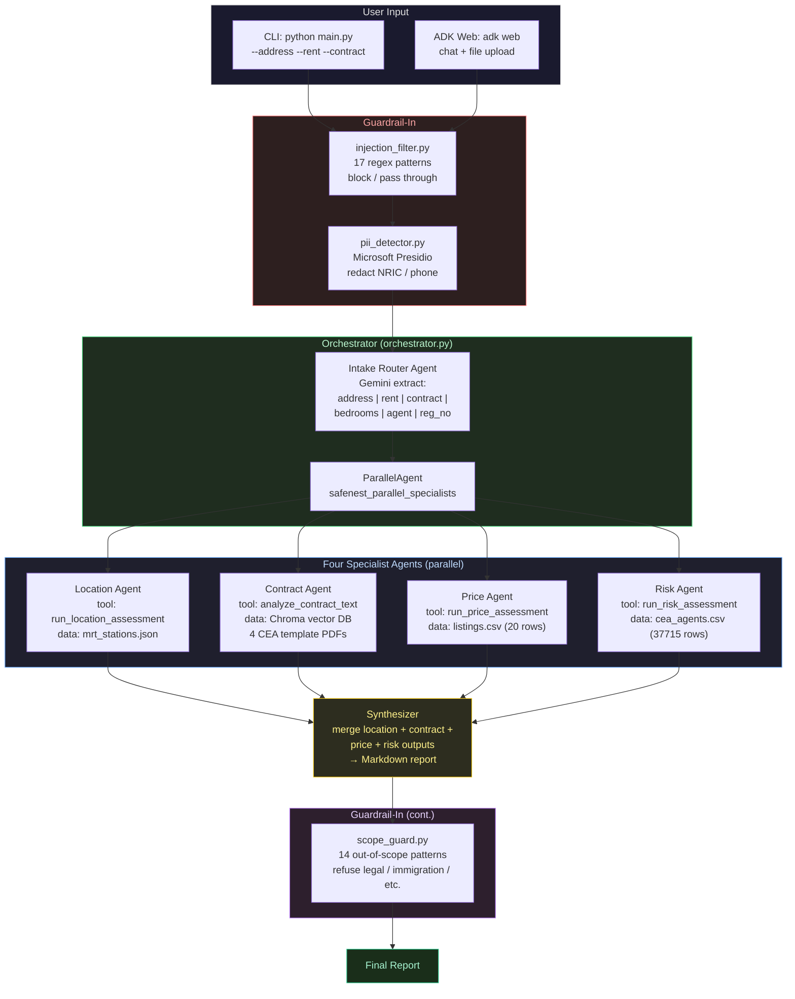

# SafeNest Architecture

> CA6123 · Agentic AI and Applications
> Architecture overview + design decision log

---

## High-level architecture



**Execution order**:

1. **Guardrail-In** — input sanitisation: prompt injection filtering + PII redaction.
2. **Intake Router Agent** — first sequential step: Gemini-driven semantic extraction of six fields (`address` / `rent` / `contract_path` / `bedrooms` / `agent_name` / `agent_reg_no`); when required fields are missing, the agent asks the user clarifying questions instead of proceeding blindly.
3. **ParallelAgent** — the four specialist agents run concurrently.
4. **Synthesizer** — final sequential step: reads the four output keys from session state and produces a Markdown report.
5. **Scope Guard** — refuses out-of-scope queries (legal advice, immigration consulting, etc.). Despite the legacy "Guardrail-Out" label in the diagram, the scope check is wired at *input* time in the intake router so that violating queries cost zero LLM tokens.

### Mapping to the agentic four-stage cycle

The above topology maps cleanly to the **Perceive → Reason → Action → Learn** cycle described in the assignment brief:

| Stage | Where in SafeNest |
|---|---|
| **Perceive** | `Guardrail-In` (`injection_filter`, `pii_detector`) sanitises every incoming query before any LLM sees it; `Intake Router Agent` then performs Gemini-driven semantic extraction of the structured rental fields out of free-form natural language. |
| **Reason** | The orchestrator uses `SequentialAgent → ParallelAgent → Synthesizer` to break the goal "evaluate this rental" into routable sub-tasks. The intake router additionally classifies intent (direct landlord vs agent-driven, rent-given vs rent-undecided, small-talk vs analysis) and routes accordingly. The Synthesizer performs cross-agent reasoning — surfacing contradictions like "low price + unregistered agent ⇒ likely scam" that no single agent would catch. |
| **Action** | All four specialists operate via `FunctionTool`-wrapped tool calls: Location uses Haversine distance over `mrt_stations.json`; Contract performs **Agentic RAG** retrieval over the Chroma vector store of CEA standard templates (bonus); Price queries `listings.csv`; Risk calls the live `data.gov.sg` CEA API with local CSV fallback. |
| **Learn** | Every LLM call is grounded by structured **in-context learning**: `INTERNAL_JSON_OUTPUT_INSTRUCTION` (in [agents/\_\_init\_\_.py](../agents/__init__.py)) gives the model the exact `AgentOutput` shape it must produce; per-agent instructions describe the workflow and the tool's expected single-call usage; Pydantic validation rejects malformed outputs at the boundary. The 175 automated tests in [tests/](../tests/) form the offline evaluation harness for this layer (Appendix B bonus: Agent Evaluation). |

**Every specialist agent has two execution paths**:

- **Deterministic path**: `assess_*()` Python functions, rule-based, zero LLM calls; used by CLI, tests, and offline scenarios.
- **ADK / LLM path**: `create_*_agent()` `LlmAgent`, LLM + tool functions; used by the ADK web UI for natural-language interaction.

| Agent | Tool exposed to the LLM | Data source | Scoring logic |
|------|---------|--------|---------|
| Location | `run_location_assessment` (internally calls `nearest_mrt` + `commute_estimate` × 2 + `surrounding_amenities`) | `mrt_stations.json` (10 stations) | Commute (60%) + surroundings (40%), 0–100 |
| Contract | `analyze_contract_text` (internally calls `extract_clauses` + `compare_to_cea_standard` + `compute_contract_risk`) | Chroma (4 CEA template PDFs) | Per-clause keyword-overlap deviation → 0–100 risk score |
| Price | `run_price_assessment` (internally calls `lookup_comparable_listings` + `compute_price_statistics` + `evaluate_rent_reasonableness`) | `listings.csv` (20 entries) | Tenant rent's percentile against the area distribution → score |
| Risk | `run_risk_assessment` (internally calls `verify_cea_agent` + `compute_risk_score` + `generate_risk_tips`) | `data.gov.sg` API + `cea_agents.csv` (**37,715** real CEA salesperson records) | Registration (60) + validity (25) + data-source reliability (15) = 100 |

> **Tool-granularity note**: each sub-agent exposes **a single aggregate tool** to the LLM; internally that tool calls multiple atomic functions in a fixed order. This deliberately avoids letting the LLM oscillate between several small tools, which we observed empirically as one trigger of runaway tool-call loops.

---

## Design decision log

### Decision 1 — Why ADK SequentialAgent + ParallelAgent

| Dimension | Content |
|------|------|
| **Question** | How should the four analysis tasks (commute / contract / price / risk) be orchestrated? |
| **Options** | A) all sequential; B) all parallel; C) `Sequential(Intake → Parallel(4 agents) → Synthesizer)` |
| **Choice** | **C** — hybrid orchestration. |
| **Rationale** | Intake must extract structured fields before any analysis can begin; the four analyses are independent and can run in parallel to cut latency; the Synthesizer must wait for all four to finish before merging. ADK's `SequentialAgent` + `ParallelAgent` express this topology natively, so we never manage `asyncio` by hand. |

### Decision 2 — Why every agent has a deterministic + LLM dual path

| Dimension | Content |
|------|------|
| **Question** | Should each agent's reasoning live in the LLM or in code? |
| **Options** | A) pure LLM (flexible but expensive); B) pure rules (cheap but rigid); C) dual path |
| **Choice** | **C** — every agent ships an `assess_*()` deterministic function (used by CLI / tests / offline) AND a `create_*_agent()` LlmAgent (used by ADK web). |
| **Rationale** | Tests need deterministic results; offline mode must work without an API key; ADK web mode benefits from LLM-driven natural-language input. Both paths share the same underlying tool functions, so behaviour stays consistent across modes. |

### Decision 3 — Why the Contract Agent uses keyword-overlap scoring

| Dimension | Content |
|------|------|
| **Question** | Contract clause comparison: LLM-based or algorithmic? |
| **Options** | A) LLM compares each clause; B) keyword-overlap deviation; C) hybrid |
| **Choice** | **C** — keyword overlap as the primary signal, LLM as a secondary qualitative judge in ADK mode. |
| **Rationale** | Keyword-overlap scoring (`_keyword_overlap_score`) needs no API call, costs zero tokens, and is 100% reproducible. The LLM in ADK mode adds qualitative judgement via the `analyze_contract_text` tool — best of both worlds. |

### Decision 4 — Why the Risk Agent uses two-tier verification

| Dimension | Content |
|------|------|
| **Question** | CEA salesperson lookup: external API or local data? |
| **Options** | A) API only; B) local CSV only; C) API → CSV fallback |
| **Choice** | **C** — two-tier with fallback. |
| **Rationale** | The `data.gov.sg` API is free but occasionally times out or returns 503. The local `cea_agents.csv` (**37,715** real salesperson records) provides offline robustness — a verification verdict is always available even with no internet. When the API succeeds we tag `source="api"`, which earns the highest data-source-reliability score. |

### Decision 5 — Why guardrails are layered

| Dimension | Content |
|------|------|
| **Question** | Where in the agent pipeline should safety guardrails sit? |
| **Options** | A) input only; B) output only; C) both layered |
| **Choice** | **C** — layered. |
| **Rationale** | Guardrail-In (`injection_filter` + `pii_detector`) blocks malicious input and redacts PII before it reaches any LLM. Scope Guard refuses out-of-scope requests (legal advice, immigration, medical, etc.). All three layers are wired at the intake router so violating queries cost zero LLM tokens. The two layers are independent and can be toggled separately. |

### Decision 6 — Token-cost optimisation

| Dimension | Content |
|------|------|
| **Question** | The full contract text (~4,368 chars) was being injected into both Contract Agent and Risk Agent prompts, causing duplicate token cost. |
| **Options** | A) no optimisation; B) truncate inside Risk Agent only; C) trim across all agents |
| **Choice** | **B** — truncate Risk Agent's contract input + trim Contract Agent's `ref_text` |
| **Rationale** | Risk Agent only needs the first ~800 characters of the contract to find the agent name; it does not need the full text. Contract Agent's `clause_results` `ref_text` was trimmed from 300 → 150 characters since the Synthesizer only consumes summaries. Net token savings ~24% with no functional loss. |

### Decision 7 — Python 3.13 + OpenTelemetry compatibility

| Dimension | Content |
|------|------|
| **Question** | Python 3.13's `asyncio.TaskGroup` and OpenTelemetry SDK 1.41's `contextvars` have a known incompatibility. Each cross-agent span detach raises `ValueError: created in a different Context`, which trips ADK's `tenacity` retry storm and burns ~2.6 M tokens per run. |
| **Options** | A) disable the OTel SDK; B) monkey-patch the SDK; C) `OTEL_TRACES_EXPORTER=none` |
| **Choice** | **C** — disable trace exporting via environment variable. |
| **Rationale** | With `OTEL_TRACES_EXPORTER=none`, OTel still collects spans but no longer triggers detach errors at the exporter boundary. Other projects on the same machine that rely on OTel are unaffected. |

---

## Data flow

```
User input
  │
  ├─ [Guardrail-In] check_injection(user_text)
  │     ├─ blocked=True → return INJECTION_BLOCK_MESSAGE, end run
  │     └─ blocked=False → continue
  │
  ├─ [Guardrail-In] check_scope(user_text)
  │     ├─ refused=True → return SCOPE_REFUSAL_TEMPLATE, end run
  │     └─ refused=False → continue
  │
  ├─ [Guardrail-In] redact_pii(user_text)
  │     └─ NRIC / phone / email → replaced with <ENTITY_TYPE>; redacted copy stored in session.state for audit
  │
  ▼
Intake Router Agent
  │  Extracts: address, rent, contract_path, bedrooms, agent_name, agent_reg_no
  │  Stores them in session.state
  │  (If required fields are missing, asks the user a follow-up question and ends this turn)
  │
  ▼
ParallelAgent ──┬── Location Agent  ──→ location_output
                ├── Contract Agent  ──→ contract_output
                ├── Price Agent     ──→ price_output
                └── Risk Agent      ──→ risk_output
  │
  ▼
Synthesizer
  │  Reads four output keys from session.state → produces Markdown report → writes to final_report
  │
  ▼
Final Report
```

---

## Tech stack

| Component | Choice | Notes |
|------|------|------|
| LLM | Gemini 2.5 Flash / Flash Lite | `specialist_model` / `synthesizer_model` in [config.py](../config.py) |
| Agent framework | Google ADK (Python) | `SequentialAgent` + `ParallelAgent` + `LlmAgent` |
| Vector store | Chroma | Local ONNX embeddings, no external API dependency |
| PDF parsing | pypdf + pdfplumber | Two-tier: pypdf is fast, pdfplumber is the layout-aware fallback |
| PII detection | Regex-based, Presidio-aware | Guardrail-In; regex catches NRIC / EMAIL / SG_PHONE / PERSON. When `presidio_analyzer` import fails, returns `[]` gracefully. See [docs/guardrail_report.md](guardrail_report.md). |
| Observability | ADK built-in trace | OTel exporter intentionally disabled (Python 3.13 compatibility, Decision 7) |
