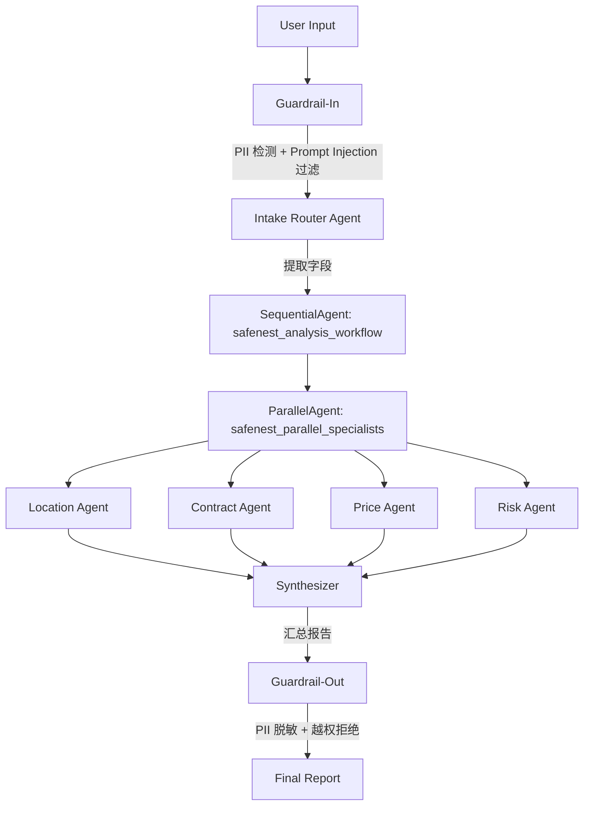

# SafeNest Architecture

> CA6123 · Agentic AI and Applications
> 设计决策记录 + 架构说明

---

## 架构总览



**执行顺序**：

1. **Intake Router Agent**（串行第一步）— 从用户输入中提取 address / rent / contract_path / bedrooms / agent_name / agent_reg_no。若字段缺失，反问用户补齐。
2. **4 个 Specialist Agent**（并行）— Location / Contract / Price / Risk 独立分析，各自写入 session state。
3. **Synthesizer**（串行最后一步）— 读取 4 个 Agent 的 output_key，生成统一 Markdown 报告。

---

## 设计决策记录

### 决策 1：为什么用 ADK SequentialAgent + ParallelAgent

| 维度 | 内容 |
|------|------|
| **问题** | 4 个分析任务（通勤/合同/价格/风险）如何编排？ |
| **选项** | A) 全串行 B) 全并行 C) Sequential(Intake → Parallel(4 agents) → Synthesizer) |
| **选择** | C — 混合编排 |
| **理由** | Intake 必须先提取结构化字段才能开始分析；4 个分析任务互不依赖，并行可以节省延迟；Synthesizer 必须等 4 个分析全部完成才能汇总。ADK 的 `SequentialAgent` + `ParallelAgent` 原生支持这个拓扑，无需手动管理 asyncio。 |

### 决策 2：为什么每个 Agent 都有确定性 + LLM 双路径

| 维度 | 内容 |
|------|------|
| **问题** | Agent 的推理逻辑应该走 LLM 还是硬编码？ |
| **选项** | A) 纯 LLM（灵活但贵） B) 纯规则（便宜但不灵活） C) 双路径 |
| **选择** | C — 每个 Agent 提供 `assess_*()` 确定性函数（CLI / 测试 / 离线用）+ `create_*_agent()` LlmAgent（ADK web 用） |
| **理由** | 测试需要确定性结果；离线模式下不需要 API key；ADK web 模式下 LLM 可以处理自然语言输入。两种模式共享同一套工具函数。 |

### 决策 3：为什么 Contract Agent 用关键词重叠度

| 维度 | 内容 |
|------|------|
| **问题** | 合同条款对比：用 LLM 还是算法？ |
| **选项** | A) LLM 逐条对比 B) 关键词重叠度 C) 两者结合 |
| **选择** | C — 关键词重叠度为主，LLM 为辅（ADK 模式） |
| **理由** | 关键词重叠度（`_keyword_overlap_score`）无需 API 调用、零 token 消耗、100% 可复现。LLM 在 ADK 模式下通过 `search_cea_clause` 工具补充定性判断。 |

### 决策 4：为什么 Risk Agent 用双层验证

| 维度 | 内容 |
|------|------|
| **问题** | CEA 代理查询：依赖外部 API 还是本地数据？ |
| **选项** | A) 纯 API B) 纯本地 CSV C) API → CSV 回退 |
| **选择** | C — 双层回退 |
| **理由** | data.gov.sg API 免费但偶尔超时 / 503。本地 `cea_agents.csv`（30 条真实代理数据）作为离线兜底，保证即使在无网络环境下也能给出验证结论。API 成功时标记 `source="api"` 获得最高数据源评分。 |

### 决策 5：为什么 Guardrail 分 In / Out 两层

| 维度 | 内容 |
|------|------|
| **问题** | 安全护栏应该放在 Agent 管道的哪个位置？ |
| **选项** | A) 只在输入 B) 只在输出 C) In + Out 分层 |
| **选择** | C — 分层 |
| **理由** | Guardrail-In（`injection_filter` + `pii_detector`）拦截恶意输入、脱敏隐私，防止 LLM 被操纵。Guardrail-Out（`scope_guard`）在输出阶段拒绝越权请求（法律建议、签证咨询等）。两层独立，可各自开关。 |

### 决策 6：Token 优化策略

| 维度 | 内容 |
|------|------|
| **问题** | 合同全文 (4368 chars) 被 Contract 和 Risk 两个 Agent 重复注入 LLM，消耗大。 |
| **选项** | A) 不做优化 B) Risk Agent 截断 C) 精简所有 Agent |
| **选择** | B — Risk Agent 截断 + Contract Agent ref_text 截断 |
| **理由** | Risk Agent 只需要合同头部 800 字符来找代理名，不需要全文。Contract Agent 输出的 `clause_results` 中每条 ref_text 从 300 截到 150 字符（Synthesizer 只看摘要）。两项合计节省 ~24% token，不影响功能。 |

### 决策 7：Python 3.13 + OTel 兼容方案

| 维度 | 内容 |
|------|------|
| **问题** | Python 3.13 的 `asyncio.TaskGroup` 与 OpenTelemetry SDK 1.41 的 contextvars 存在已知不兼容，每次跨 Agent 的 span detach 抛出 `ValueError: created in a different Context`，触发 ADK tenacity 重试风暴，单次运行消耗 2.6M tokens。 |
| **选项** | A) 禁用 OTel SDK B) monkey-patch C) `OTEL_TRACES_EXPORTER=none` |
| **选择** | C — 环境变量禁用 trace 导出 |
| **理由** | 设置 `OTEL_TRACES_EXPORTER=none` 后，OTel span 采集仍正常进行但不会触发导出端的 detach 错误。不影响队友其他项目的 OTel 使用。 |

---

## 数据流详解

```
用户输入
  │
  ├─ [Guardrail-In] injection_filter.detect_injection()
  │     ├─ flagged=True → 返回 INJECTION_BLOCK_MESSAGE，流程终止
  │     └─ flagged=False → 继续
  │
  ├─ [Guardrail-In] pii_detector.redact_pii()
  │     └─ NRIC / 手机号 等 → 替换为 <PERSON> / <PHONE_NUMBER>
  │
  ▼
Intake Router Agent
  │  提取: address, rent, contract_path, bedrooms, agent_name, agent_reg_no
  │  存入: session state
  │
  ▼
ParallelAgent ──┬── Location Agent  ──→ location_output
                ├── Contract Agent  ──→ contract_output
                ├── Price Agent     ──→ price_output
                └── Risk Agent      ──→ risk_output
  │
  ▼
Synthesizer
  │  读取 4 个 output_key → 生成 Markdown 报告 → 写入 final_report
  │
  ├─ [Guardrail-Out] scope_guard.check_scope()
  │     ├─ in_scope=False → 替换为 SCOPE_REFUSAL_TEMPLATE
  │     └─ in_scope=True → 原文输出
  │
  ▼
Final Report
```

---

## 技术栈

| 组件 | 选择 | 备注 |
|------|------|------|
| LLM | Gemini 2.5 Flash / Flash Lite | `config.py` 中 `specialist_model` / `synthesizer_model` |
| Agent 框架 | Google ADK (Python) | SequentialAgent + ParallelAgent + LlmAgent |
| 向量库 | Chroma | 本地 ONNX embedding，无外部 API 依赖 |
| PDF 解析 | pypdf + pdfplumber | 双层策略：pypdf 快读，pdfplumber 回退 |
| PII 检测 | Microsoft Presidio | Guardrail-In；无 Presidio 时降级跳过 |
| 观测 | ADK 内置 trace | OTel exporter 已禁用（Python 3.13 兼容） |
